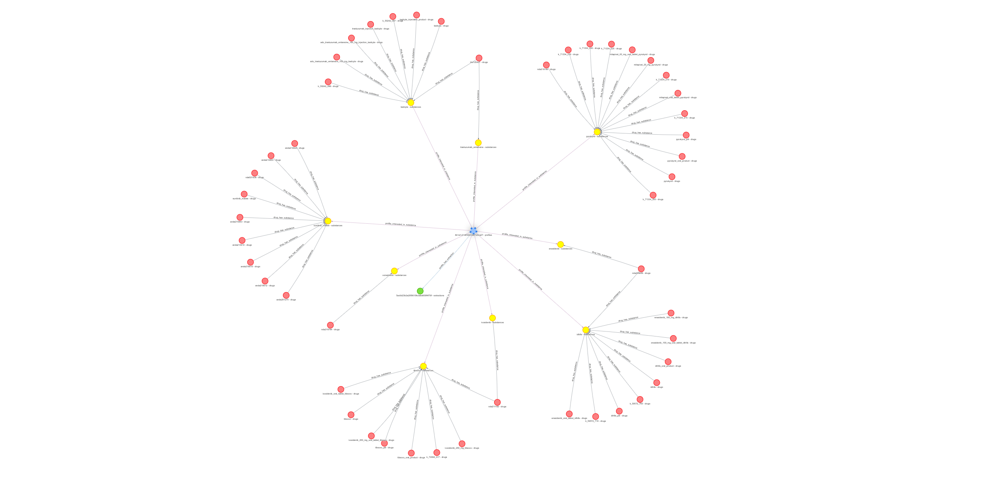
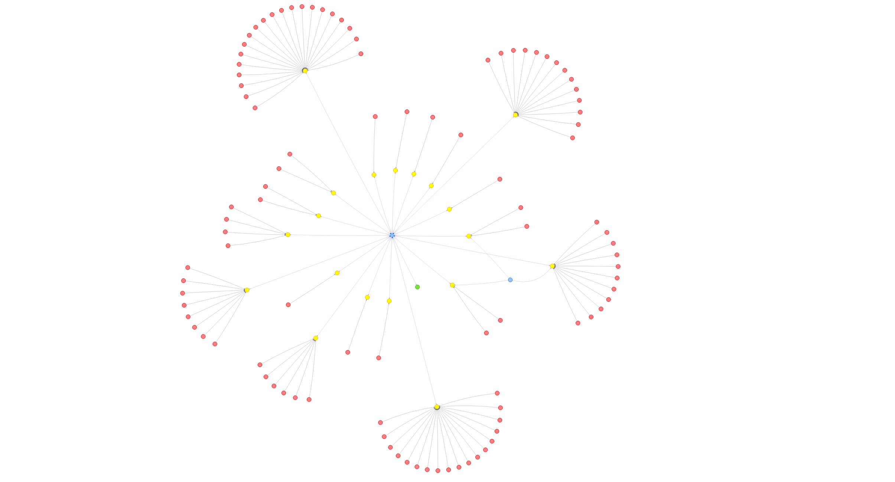
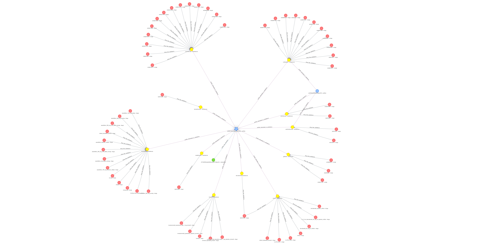
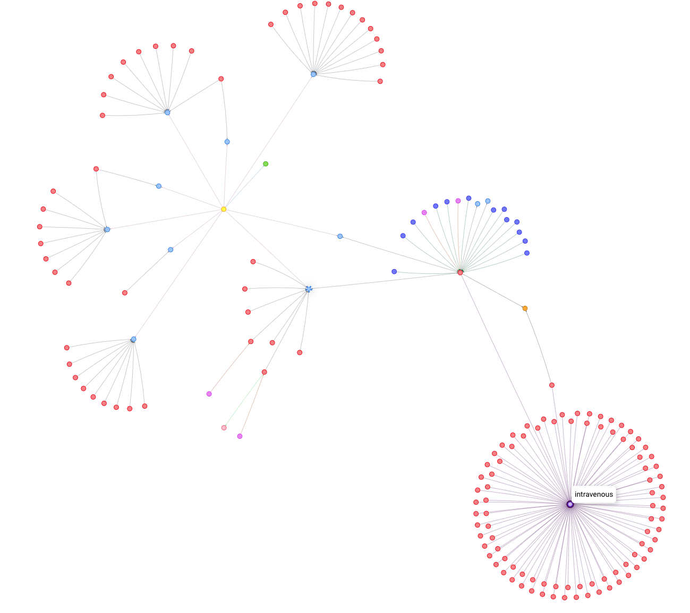
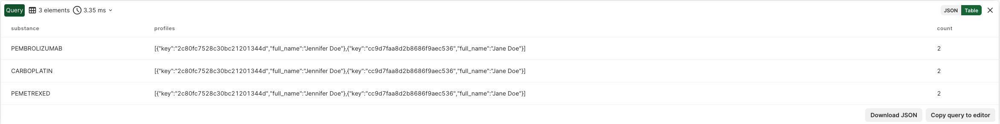
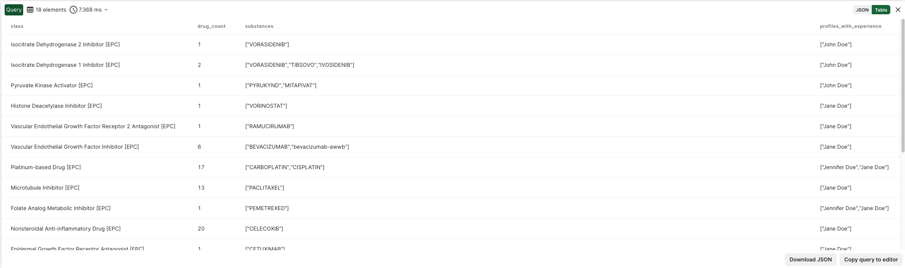
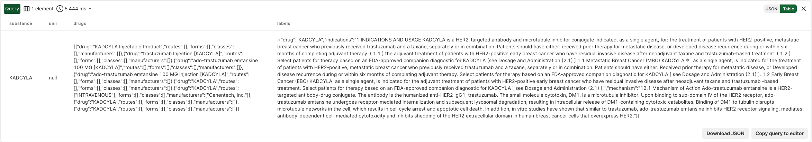
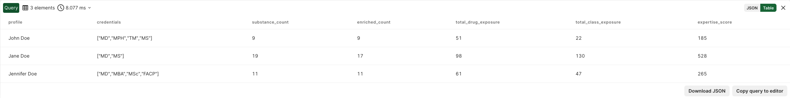

# Pharma Knowledge Graph

This document details the knowledge graph implementation in the Pharma NER/NEL system, focusing on graph structure, traversal patterns, and extension possibilities.

---

## Table of Contents

1. [Overview](#overview)
2. [Graph Schema](#graph-schema)
3. [Vertex Collections](#vertex-collections)
4. [Edge Collections](#edge-collections)
5. [Graph Visualizations](#graph-visualizations)
6. [AQL Query Patterns](#aql-query-patterns)
7. [Repository Implementation](#repository-implementation)
8. [Extending the Knowledge Graph](#extending-the-knowledge-graph)
9. [Advanced Query Examples](#advanced-query-examples)

---

## Overview

The system uses **ArangoDB** as a multi-model database, leveraging its native graph capabilities to model pharmaceutical relationships. The graph `openfda_drug_graph` connects:

- **User Profiles** (extracted from resumes)
- **Extractions** (NER/NEL processing results)
- **Substances** (chemical compounds)
- **Drugs** (commercial products)
- **Regulatory Data** (FDA applications, labels, products)
- **Classifications** (pharmacological classes, routes, dosage forms)

### Why a Knowledge Graph?

Traditional relational databases struggle with:
- Multi-hop relationship queries (e.g., "Find all profiles interested in drugs that cause a specific reaction")
- Dynamic schema evolution (new entity types, new relationships)
- Traversal-heavy workloads (graph algorithms, path finding)

ArangoDB's graph model enables:
- **O(1) edge traversal** via adjacency lists
- **Variable-depth queries** with `FOR v IN 1..N`
- **Native graph algorithms** (shortest path, centrality, community detection)
- **Hybrid queries** combining document filters with graph traversals

---

## Graph Schema

```
Graph Name: openfda_drug_graph

Vertex Collections (13):
├── profiles          # User profiles from resumes
├── extractions       # NER/NEL extraction results
├── substances        # Chemical substances (UNII, RxNorm)
├── drugs             # Commercial drug products
├── manufacturers     # Drug manufacturers
├── routes            # Administration routes
├── dosage_forms      # Dosage forms
├── pharm_classes     # Pharmacological classes (EPC, MOA)
├── reactions         # Adverse reactions
├── applications      # FDA applications (NDA, ANDA)
├── products          # NDC products/packages
├── interactions      # Drug-drug interactions
└── drug_labels       # Package inserts/labels

Edge Collections (13):
├── profile_has_extraction           # Profile -> Extraction
├── profile_interested_in_substance  # Profile -> Substance
├── drug_has_substance               # Drug -> Substance
├── drug_has_route                   # Drug -> Route
├── drug_has_form                    # Drug -> Dosage Form
├── drug_in_class                    # Drug -> Pharm Class
├── drug_by_manufacturer             # Drug -> Manufacturer
├── drug_has_label                   # Drug -> Drug Label
├── drug_causes_reaction             # Drug -> Reaction
├── drug_interacts_with              # Drug -> Interaction
├── drug_alias_of                    # Drug -> Drug (brand/generic alias)
├── application_for_drug             # Application -> Drug
└── product_of_drug                  # Product -> Drug
```

---

## Vertex Collections

### Core User Data

| Collection | Description | Key Fields |
|------------|-------------|------------|
| `profiles` | User profiles extracted from resumes | `full_name`, `email`, `credentials`, `linkedin`, `therapeutic_areas` |
| `extractions` | NER/NEL processing results | `file_hash`, `filename`, `status`, `entities`, `meta`, `quality` |

### Pharmaceutical Entities

| Collection | Description | Key Fields |
|------------|-------------|------------|
| `substances` | Chemical compounds | `name`, `unii`, `rxcui`, `cas_number`, `formula`, `molecular_weight`, `is_enriched` |
| `drugs` | Commercial drug products | `application_number`, `brand_names`, `generic_names`, `rxcui`, `ndc_codes`, `sponsor_name`, `is_enriched` |
| `manufacturers` | Drug manufacturers | `name` |
| `routes` | Administration routes | `name` (e.g., "ORAL", "INTRAVENOUS") |
| `dosage_forms` | Dosage forms | `name` (e.g., "TABLET", "INJECTION") |
| `pharm_classes` | Pharmacological classes | `name`, `class_type` (EPC, MOA, PE, CS) |

### Regulatory & Safety Data

| Collection | Description | Key Fields |
|------------|-------------|------------|
| `applications` | FDA applications | `application_number`, `submission_type`, `submission_status`, `review_priority` |
| `products` | NDC products/packages | `product_number`, `package_ndc`, `brand_name`, `marketing_status` |
| `drug_labels` | Package inserts | `spl_id`, `indications_and_usage`, `contraindications`, `boxed_warning`, `adverse_reactions` |
| `reactions` | Adverse reactions | `name`, `meddra_version` |
| `interactions` | Drug-drug interactions | `severity`, `source_drug_name`, `target_drug_name`, `description` |

---

## Edge Collections

### Profile Relationships

```
profile_has_extraction
  FROM: profiles
  TO:   extractions
  PURPOSE: Links a user profile to their document extractions

profile_interested_in_substance
  FROM: profiles
  TO:   substances
  PURPOSE: Tracks which substances appear in a user's resume/experience
```

### Drug Relationships

```
drug_has_substance
  FROM: drugs
  TO:   substances
  PURPOSE: Links drug products to their active ingredients

drug_has_route
  FROM: drugs
  TO:   routes
  PURPOSE: Administration routes for a drug

drug_has_form
  FROM: drugs
  TO:   dosage_forms
  PURPOSE: Available dosage forms

drug_in_class
  FROM: drugs
  TO:   pharm_classes
  PURPOSE: Pharmacological classification (mechanism of action, etc.)

drug_by_manufacturer
  FROM: drugs
  TO:   manufacturers
  PURPOSE: Manufacturing relationships

drug_alias_of
  FROM: drugs
  TO:   drugs
  PURPOSE: Links brand names to generic equivalents (self-referential)
```

### Regulatory Relationships

```
application_for_drug
  FROM: applications
  TO:   drugs
  PURPOSE: FDA application (NDA/ANDA) for drug approval

product_of_drug
  FROM: products
  TO:   drugs
  PURPOSE: NDC product packages for a drug

drug_has_label
  FROM: drugs
  TO:   drug_labels
  PURPOSE: Package insert/labeling information
```

### Safety Relationships

```
drug_causes_reaction
  FROM: drugs
  TO:   reactions
  PURPOSE: Known adverse reactions

drug_interacts_with
  FROM: drugs
  TO:   interactions
  PURPOSE: Drug-drug interaction data from RxNorm
```

---

## Graph Visualizations

### Sample Processing Results

The following images show the knowledge graph generated from processing sample resumes:

#### John Doe Resume


#### Jane Doe Resume


#### Jennifer Doe Resume


**Color Legend:**
- **Blue**: Profile vertex (user)
- **Green**: Extraction vertex (NER result)
- **Yellow**: Substance vertex (chemical compound)
- **Red**: Drug vertex (commercial product)

### Substance Detail Graph: KADCYLA

The following image shows a detailed 3-level graph traversal for the substance KADCYLA (ado-trastuzumab emtansine):



This visualization demonstrates the rich relationships captured in the knowledge graph, including:
- Drug-substance relationships
- Pharmacological classifications
- Manufacturing information
- Administration routes and dosage forms

---

## AQL Query Patterns

### Pattern 1: Single-Hop Traversal

Get all substances for a drug:

```aql
FOR v IN 1..1 OUTBOUND drug drug_has_substance
    RETURN v
```

### Pattern 2: Multi-Hop Traversal

Get all drugs and their classes for a substance:

```aql
FOR drug IN 1..1 INBOUND substance drug_has_substance
    FOR class IN 1..1 OUTBOUND drug drug_in_class
        RETURN { drug: drug.brand_names, class: class.name }
```

### Pattern 3: Aggregated Traversal

Get profile with substance and drug counts:

```aql
FOR p IN profiles
    LET extraction_count = LENGTH(
        FOR e IN 1..1 OUTBOUND p profile_has_extraction RETURN 1
    )
    LET substance_count = LENGTH(
        FOR s IN 1..1 OUTBOUND p profile_interested_in_substance RETURN 1
    )
    RETURN {
        name: p.full_name,
        extractions: extraction_count,
        substances: substance_count
    }
```

### Pattern 4: Deep Traversal with Filtering

Find all profiles interested in drugs that cause a specific reaction:

```aql
FOR reaction IN reactions
    FILTER reaction.name == "NAUSEA"
    FOR drug IN 1..1 INBOUND reaction drug_causes_reaction
        FOR substance IN 1..1 OUTBOUND drug drug_has_substance
            FOR profile IN 1..1 INBOUND substance profile_interested_in_substance
                RETURN DISTINCT {
                    profile: profile.full_name,
                    substance: substance.name,
                    drug: drug.brand_names[0],
                    reaction: reaction.name
                }
```

### Pattern 5: Path Finding

Find connection path between two substances:

```aql
FOR path IN OUTBOUND SHORTEST_PATH
    'substances/aspirin' TO 'substances/ibuprofen'
    GRAPH 'openfda_drug_graph'
    RETURN path
```

---

## Repository Implementation

The graph operations are implemented across several repository classes:

### BaseRepository (`base.py`)

Provides common CRUD operations and AQL query execution:

```python
class BaseRepository(Generic[T]):
    async def execute_query(self, query: str, bind_vars: dict) -> list[dict]:
        """Execute an AQL query."""
        cursor = await self._db.aql.execute(query, bind_vars=bind_vars or {})
        results = []
        async with cursor:
            async for doc in cursor:
                results.append(doc)
        return results
```

### OpenFDAGraphRepository (`openfda_graph_repository.py`)

Main graph repository with schema management and complex traversals:

**Key Methods:**

| Method | Description |
|--------|-------------|
| `ensure_graph()` | Creates graph and all edge definitions if not exists |
| `persist_graph_data()` | Persists complete enrichment result (vertices + edges) |
| `get_drug_with_relations()` | Single drug with all related entities |
| `get_substance_relations()` | Complete substance data with drugs, classes, labels, etc. |
| `get_graph_stats()` | Collection counts for monitoring |
| `get_profiles_interested_in_substance()` | Reverse traversal from substance to profiles |

**Graph Traversal Example:**

```python
async def get_substance_relations(self, substance_key: str) -> dict[str, Any]:
    query = """
    LET substance = DOCUMENT(CONCAT("substances/", @substance_key))

    LET drugs = (
        FOR drug IN 1..1 INBOUND substance drug_has_substance
            RETURN { key: drug._key, brand_names: drug.brand_names, ... }
    )

    LET pharm_classes = (
        FOR drug IN drug_docs
            FOR pc IN 1..1 OUTBOUND drug drug_in_class
                COLLECT key = pc._key, name = pc.name, class_type = pc.class_type
                RETURN { key, name, class_type }
    )
    
    // ... more traversals for routes, forms, labels, etc.
    
    RETURN { drugs, pharm_classes, manufacturers, routes, ... }
    """
```

### ProfileRepository (`profile_repository.py`)

Manages profile-centric graph operations:

**Edge Creation:**

```python
async def create_substance_edge(self, profile_key: str, substance_key: str) -> bool:
    """Create edge from profile to substance."""
    edge_key = hashlib.md5(
        f"profiles/{profile_key}_substances/{substance_key}".encode()
    ).hexdigest()[:16]
    
    edge_doc = {
        "_key": edge_key,
        "_from": f"profiles/{profile_key}",
        "_to": f"substances/{substance_key}",
    }
    
    collection = self._db.collection("profile_interested_in_substance")
    await collection.insert(edge_doc)
```

**Complex Profile Query:**

```python
async def get_profile_with_details(self, profile_key: str) -> dict[str, Any]:
    """Get profile with extractions, substances, drugs, and stats."""
    query = """
    LET profile = DOCUMENT(CONCAT("profiles/", @profile_key))
    
    LET substances = (
        FOR s IN 1..1 OUTBOUND profile profile_interested_in_substance
            LET drug_docs = (FOR d IN 1..1 INBOUND s drug_has_substance RETURN d)
            LET drugs = (FOR d IN drug_docs RETURN { key: d._key, brand_names: d.brand_names })
            LET routes = UNIQUE(FOR d IN drug_docs FOR r IN 1..1 OUTBOUND d drug_has_route RETURN r)
            LET pharm_classes = UNIQUE(FOR d IN drug_docs FOR pc IN 1..1 OUTBOUND d drug_in_class RETURN pc)
            RETURN { key: s._key, name: s.name, drugs, routes, pharm_classes }
    )
    
    RETURN { profile, substances, stats: { total_substances: LENGTH(substances) } }
    """
```

### DrugRepository (`drug_repository.py`)

Drug-specific queries with alias resolution:

```python
async def find_by_alias(self, alias_name: str) -> Drug | None:
    """Find target drug via alias edge."""
    query = """
    FOR alias IN drugs
        FILTER alias._key == @alias_key AND alias.is_alias == true
        FOR target IN 1..1 OUTBOUND alias drug_alias_of
            FILTER target.is_enriched == true
            LIMIT 1
            RETURN target
    """
```

---

## Extending the Knowledge Graph

### Adding New Vertex Collections

1. **Define the collection** in `OPENFDA_DRUG_GRAPH_SCHEMA`:

```python
"vertex_collections": [
    # ... existing collections
    "clinical_trials",  # New collection
]
```

2. **Create a domain entity** in `src/domain/entities/`:

```python
@dataclass
class ClinicalTrial:
    key: str
    nct_id: str
    title: str
    phase: str
    status: str
    # ...
```

3. **Create a repository** in `src/infrastructure/database/repositories/`:

```python
class ClinicalTrialRepository(BaseRepository[ClinicalTrial]):
    collection_name: ClassVar[str] = "clinical_trials"
    indices: ClassVar[list[IndexDefinition]] = [
        IndexDefinition(fields=["nct_id"], unique=True),
        IndexDefinition(fields=["status"], type="persistent"),
    ]
```

### Adding New Edge Collections

1. **Define the edge** in `OPENFDA_DRUG_GRAPH_SCHEMA`:

```python
"edge_definitions": [
    # ... existing edges
    {
        "edge_collection": "drug_in_trial",
        "from_vertex_collections": ["drugs"],
        "to_vertex_collections": ["clinical_trials"],
    },
]
```

2. **Add edge definition** to `OpenFDAGraphRepository`:

```python
edge_definitions: ClassVar[list[EdgeDefinition]] = [
    # ... existing
    EdgeDefinition(
        collection="drug_in_trial",
        from_collections=["drugs"],
        to_collections=["clinical_trials"],
    ),
]
```

3. **Implement edge creation** in the appropriate repository.

### Potential Extensions

| Extension | New Vertices | New Edges | Data Source |
|-----------|--------------|-----------|-------------|
| Clinical Trials | `clinical_trials` | `drug_in_trial`, `trial_has_condition` | ClinicalTrials.gov |
| Disease Ontology | `diseases`, `symptoms` | `drug_treats_disease`, `disease_has_symptom` | MeSH, ICD-10 |
| Protein Targets | `proteins`, `genes` | `drug_targets_protein`, `protein_encoded_by` | UniProt, DrugBank |
| Literature | `publications` | `drug_mentioned_in`, `substance_studied_in` | PubMed |
| Pricing | `prices` | `drug_has_price` | GoodRx, CMS |
| Patents | `patents` | `drug_protected_by` | USPTO |

---

## Advanced Query Examples

### Query 1: Find Profiles with Overlapping Substance Interests

```aql
// Find profiles that share interest in the same substances
FOR s IN substances
    LET interested_profiles = (
        FOR p IN 1..1 INBOUND s profile_interested_in_substance
            RETURN p._key
    )
    FILTER LENGTH(interested_profiles) > 1
    RETURN {
        substance: s.name,
        profiles: interested_profiles,
        count: LENGTH(interested_profiles)
    }
```



### Query 2: Drug Safety Profile

```aql
// Get complete safety profile for a drug
FOR drug IN drugs
    FILTER drug._key == @drug_key
    LET reactions = (
        FOR r IN 1..1 OUTBOUND drug drug_causes_reaction
            RETURN { name: r.name, meddra_version: r.meddra_version }
    )
    LET interactions = (
        FOR i IN 1..1 OUTBOUND drug drug_interacts_with
            RETURN { 
                severity: i.severity, 
                target: i.target_drug_name,
                description: i.description 
            }
    )
    LET labels = (
        FOR l IN 1..1 OUTBOUND drug drug_has_label
            RETURN {
                boxed_warning: l.boxed_warning,
                contraindications: l.contraindications,
                warnings: l.warnings_and_cautions
            }
    )
    RETURN {
        drug: drug.brand_names[0],
        adverse_reactions: reactions,
        drug_interactions: interactions,
        label_warnings: labels[0]
    }
```

### Query 3: Therapeutic Area Analysis

```aql
// Analyze substances by pharmacological class
FOR pc IN pharm_classes
    FILTER pc.class_type == "EPC"  // Established Pharmacologic Class
    LET drugs_in_class = (
        FOR d IN 1..1 INBOUND pc drug_in_class
            RETURN d
    )
    LET substances_in_class = (
        FOR d IN drugs_in_class
            FOR s IN 1..1 OUTBOUND d drug_has_substance
                RETURN DISTINCT s.name
    )
    LET interested_profiles = (
        FOR d IN drugs_in_class
            FOR s IN 1..1 OUTBOUND d drug_has_substance
                FOR p IN 1..1 INBOUND s profile_interested_in_substance
                    RETURN DISTINCT p.full_name
    )
    RETURN {
        class: pc.name,
        drug_count: LENGTH(drugs_in_class),
        substances: substances_in_class,
        profiles_with_experience: interested_profiles
    }
```



### Query 4: Multi-Level Graph Expansion

```aql
// 3-level expansion from a substance (like kadcyla_3_level_graph.png)
LET substance = DOCUMENT("substances/@substance_key")

LET level1_drugs = (
    FOR d IN 1..1 INBOUND substance drug_has_substance
        RETURN d
)

LET level2 = (
    FOR d IN level1_drugs
        LET routes = (FOR r IN 1..1 OUTBOUND d drug_has_route RETURN r.name)
        LET forms = (FOR f IN 1..1 OUTBOUND d drug_has_form RETURN f.name)
        LET classes = (FOR c IN 1..1 OUTBOUND d drug_in_class RETURN { name: c.name, type: c.class_type })
        LET manufacturers = (FOR m IN 1..1 OUTBOUND d drug_by_manufacturer RETURN m.name)
        RETURN {
            drug: d.brand_names[0],
            routes: routes,
            forms: forms,
            classes: classes,
            manufacturers: manufacturers
        }
)

LET level3_labels = (
    FOR d IN level1_drugs
        FOR l IN 1..1 OUTBOUND d drug_has_label
            RETURN {
                drug: d.brand_names[0],
                indications: l.indications_and_usage,
                mechanism: l.mechanism_of_action
            }
)

RETURN {
    substance: substance.name,
    unii: substance.unii,
    drugs: level2,
    labels: level3_labels
}
```



### Query 5: Profile Expertise Scoring

```aql
// Score profiles by depth of pharmaceutical experience
FOR p IN profiles
    LET substances = (
        FOR s IN 1..1 OUTBOUND p profile_interested_in_substance
            LET drug_count = LENGTH(
                FOR d IN 1..1 INBOUND s drug_has_substance RETURN 1
            )
            LET class_count = LENGTH(
                FOR d IN 1..1 INBOUND s drug_has_substance
                    FOR c IN 1..1 OUTBOUND d drug_in_class RETURN 1
            )
            RETURN {
                name: s.name,
                drug_count: drug_count,
                class_count: class_count,
                enriched: s.is_enriched
            }
    )
    LET total_drugs = SUM(substances[*].drug_count)
    LET total_classes = SUM(substances[*].class_count)
    LET enriched_substances = LENGTH(substances[* FILTER CURRENT.enriched == true])
    RETURN {
        profile: p.full_name,
        credentials: p.credentials,
        substance_count: LENGTH(substances),
        enriched_count: enriched_substances,
        total_drug_exposure: total_drugs,
        total_class_exposure: total_classes,
        expertise_score: (enriched_substances * 10) + total_drugs + (total_classes * 2)
    }
```



---

## Performance Considerations

### Index Strategy

The repositories define indices for common query patterns:

```python
# SubstanceRepository
indices = [
    IndexDefinition(fields=["name"], type="persistent"),
    IndexDefinition(fields=["unii"], sparse=True),
    IndexDefinition(fields=["is_enriched"], type="persistent"),
]

# DrugRepository
indices = [
    IndexDefinition(fields=["application_number"], unique=False),
    IndexDefinition(fields=["brand_names[*]"], type="persistent"),
    IndexDefinition(fields=["generic_names[*]"], type="persistent"),
]
```

### Query Optimization Tips

1. **Use DOCUMENT() for direct access** instead of filtering:
   ```aql
   // Fast
   LET doc = DOCUMENT("substances/aspirin")
   
   // Slower
   FOR s IN substances FILTER s._key == "aspirin" RETURN s
   ```

2. **Limit traversal depth** when possible:
   ```aql
   FOR v IN 1..2 OUTBOUND start edge  // Bounded
   FOR v IN 1..* OUTBOUND start edge  // Unbounded (expensive)
   ```

3. **Use COLLECT for deduplication** in multi-path traversals:
   ```aql
   FOR d IN drugs
       FOR c IN 1..1 OUTBOUND d drug_in_class
           COLLECT key = c._key, name = c.name
           RETURN { key, name }
   ```

4. **Project only needed fields** in traversals:
   ```aql
   FOR v IN 1..1 OUTBOUND start edge
       RETURN { key: v._key, name: v.name }  // Not RETURN v
   ```
